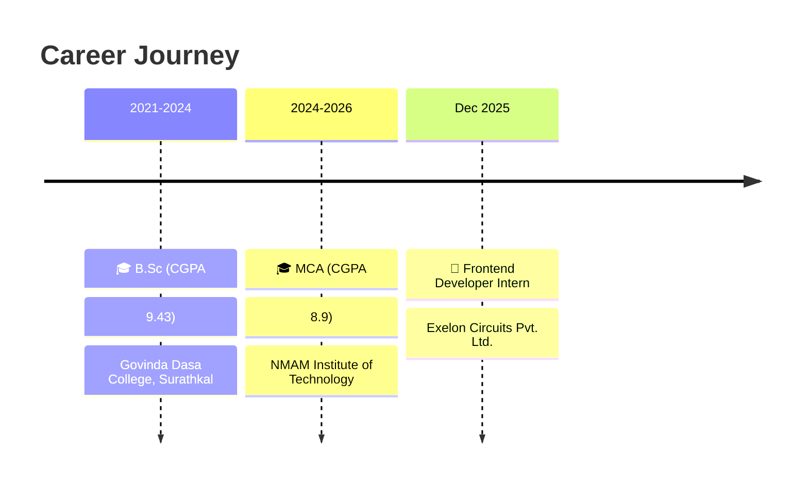

<!-- ✨ PRIYANKA'S GITHUB PROFILE ✨ -->

<div align="center">

<!-- Elegant Gradient Header -->


<!-- Elegant Name Display -->


<!-- Subtle Sparkle Divider -->


<!-- Elegant Tagline -->


<br/>

<!-- Animated Divider Line -->


<!-- Snake Animation -->


</div>

<br/>

<div align="center">

<!-- Profile Picture Style Section -->
<table>
<tr>
<td width="50%" align="center">


<!-- Social Links - Animated Icons -->
<a href="https://www.linkedin.com/in/priyanka-b04963313/">
  
</a>
<br/>
<a href="mailto:priyankakulal1205@gmail.com">
  
</a>
<br/>
<a href="https://github.com/Priyanka959">
  
</a>

</td>
</tr>
</table>

</div>

<br/>

<div align="center">

<!-- Animated Tech Icons Banner -->


<br/><br/>

<!-- Typing Animation -->


</div>

<br/>

<!-- Animated Divider -->


<br/>

<!-- About Section with Glassmorphism Style -->
<h2>
   
  &nbsp;About Me
</h2>


```yaml
name: Priyanka
located_in: India 🇮🇳
current_role: Frontend Developer Intern @ Exelon Circuits
education:
  - MCA @ NMAM Institute of Technology (CGPA: 8.9)
  - B.Sc @ Govinda Dasa College (CGPA: 9.43)

currently:
  - 🔭 Building responsive UIs with Next.js & TypeScript
  - 🌱 Exploring advanced React patterns
  - 👯 Open to collaborate on full-stack projects
  
strengths:
  - Problem Solving & Clean Architecture
  - RESTful API Design
  - Responsive & Accessible UI Development
  
fun_fact: "I debug with console.log and I'm proud of it 😄"
```

<br clear="both"/>

<br/>

<!-- Divider -->


<br/>

<!-- Tech Stack Section -->
<h2>
   
  &nbsp;Tech Arsenal
</h2>

<div align="center">

<!-- Languages -->
<h3>💻 Programming Languages</h3>
<p>
  
</p>

<!-- Frontend -->
<h3>🎨 Frontend Development</h3>
<p>
  
</p>

<!-- Backend -->
<h3>⚙️ Backend & Database</h3>
<p>
  
</p>

<!-- Tools -->
<h3>🛠️ Tools & Platforms</h3>
<p>
  
</p>

</div>

<br/>

<!-- Divider -->


<br/>

<!-- GitHub Stats Section -->
<h2>
  
  &nbsp;GitHub Analytics
</h2>

<div align="center">
  
  
  
  
</div>

<div align="center">
  
</div>

<br/>

<!-- Divider -->


<br/>

<!-- Featured Projects Section -->
<h2>
  
  &nbsp;Featured Projects
</h2>

<div align="center">

<!-- Project Cards - Custom Design -->
<table>
<tr>
<td width="50%" valign="top">

### 📚 E-Learning Platform
<p align="center">
  
  
  
</p>

```diff
+ Full-stack course management system
+ RESTful APIs with CRUD operations
+ Responsive cross-browser UI
+ Progress tracking dashboard
```

</td>
<td width="50%" valign="top">

### 🧾 Retail Invoice Generator
<p align="center">
  
  
  
</p>

```diff
+ Real-time invoice management
+ Role-based access control (RBAC)
+ Admin/Cashier dashboards
+ Relational DB schema design
```

</td>
</tr>
<tr>
<td width="50%" valign="top">

### 🌤️ Weather Forecast System
<p align="center">
  
  
  
</p>

```diff
+ Interactive charts (pie, line)
+ User favorites & locations
+ Forecast history tracking
+ Jest unit testing suite
```

</td>
<td width="50%" valign="top">

### 🫁 Pneumonia Detection (AI/ML)
<p align="center">
  
  
  
</p>

```diff
+ CNN deep learning model
+ Medical image classification
+ Real-time inference via Streamlit
+ Data augmentation techniques
```

</td>
</tr>
</table>

</div>

<br/>

<!-- Divider -->


<br/>

<!-- Experience & Education -->
<h2>
  
  &nbsp;Experience & Education
</h2>

<div align="center">



</div>

<br/>

### 📜 Certifications

<div align="center">
  
| 🏆 Certificate | 🏫 Institution | 📅 Year |
|:---:|:---:|:---:|
| Full Stack Workshop | NMAMIT | 2025 |
| SQL for Data Analytics | Udemy | 2024 |
| MongoDB | Udemy | 2024 |

</div>

<br/>

<!-- Divider -->


<br/>

<!-- Connect Section -->
<h2>
  
  &nbsp;Let's Connect!
</h2>

<div align="center">
  
<p><i>I'm always excited to collaborate on interesting projects or discuss new opportunities!</i></p>

<br/>

<a href="https://www.linkedin.com/in/priyanka-b04963313/">
  
</a>
&nbsp;&nbsp;&nbsp;&nbsp;
<a href="mailto:priyankakulal1205@gmail.com">
  
</a>
&nbsp;&nbsp;&nbsp;&nbsp;
<a href="https://github.com/Priyanka959">
  
</a>

<br/><br/>

<!-- Random Quote -->


</div>

<br/>

<!-- Activity Graph -->
<div align="center">
  
</div>

<br/>

<!-- Footer -->
<div align="center">
  
### 💭 *"First, solve the problem. Then, write the code."* – John Johnson

<br/>


</div>

<!---
Priyanka959/Priyanka959 is a ✨ special ✨ repository because its `README.md` (this file) appears on your GitHub profile.
--->
